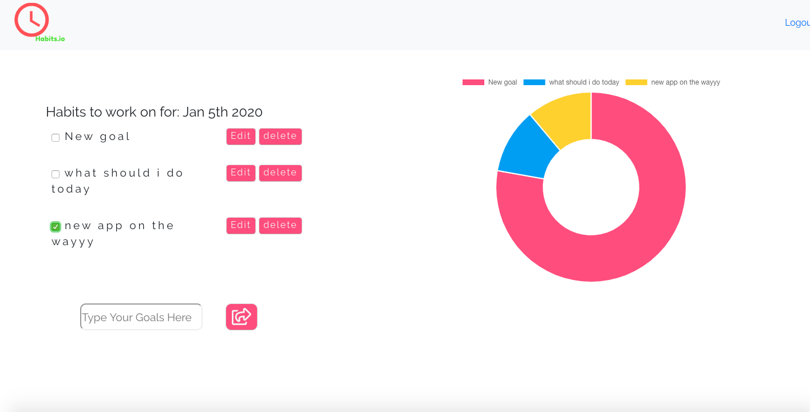
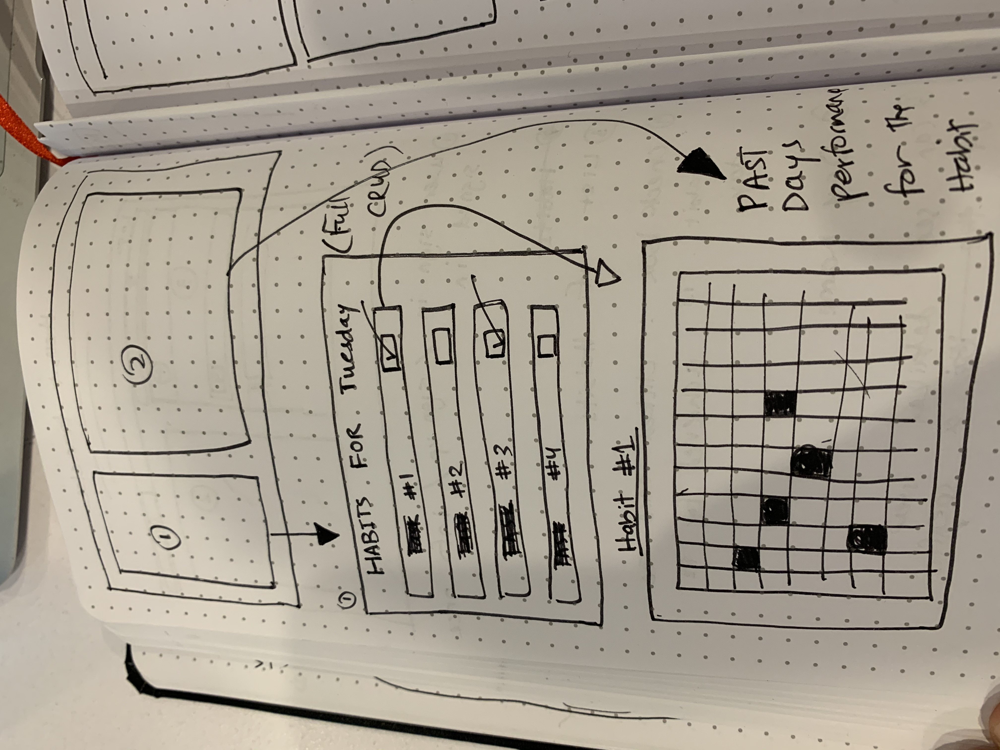
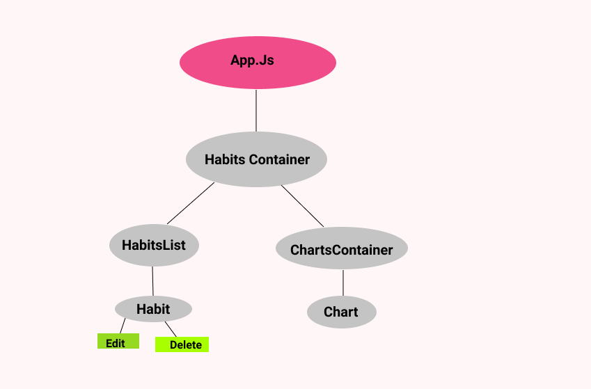

# Habits.io #
Habits.io is an app that you can use to track how often and how consistently you have been keeping up with your goals and habits. 
 Habits.io makes it easy to understand your habits by allowing you to see data visually. 

Wire-frames : 

React structure: 

### Stack Used : MongoDb, Express , React , NodeJs ###

